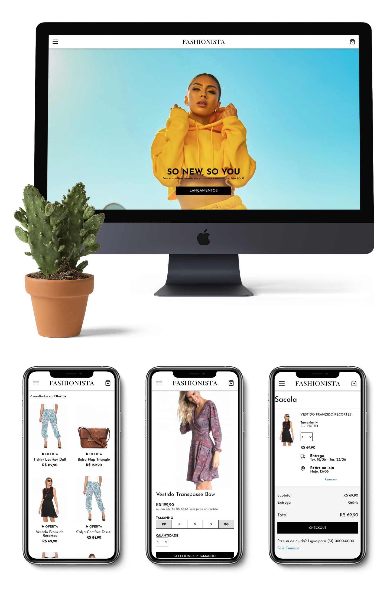

<h1 align="center">
    
</h1>

<h4 align="center">
    Aceleração React Codenation 🚀
</h4>

<p align="center">
    
    
    <a href="https://www.linkedin.com/in/lucas-arcanjo/">
        
    </a>
    
</p>

<h4 align="center"> <a href="https://fashion-ecommerce.vercel.app/" title="View with Vercel">Live Demo</a></h4>

## 📕 Projeto

Fashionista é um portal de moda feminina que visa garantir a melhor experiência para os usuários durante sua interação com os produtos. 



## 💻 Tecnologias

Este projeto foi desenvolvido utilizando:

- [React](https://reactjs.org)
- [Redux](https://react-redux.js.org/)
- [SASS](https://sass-lang.com/)

## 🎨 Design

O design foi inspirado em referências de ecommerce que tem propósito semelhante ao Fashionista: Dafiti, Nordstrom e Madewell.

## 🏗️ Construção

O projeto foi baseado neste [endpoint](https://5e9935925eabe7001681c856.mockapi.io/api/v1/catalog) onde uma lista de produtos e seus respectivos atributos são fornecidos. Exemplo de produto proveniente da API:

```json
{
    "name": "VESTIDO TRANSPASSE BOW",
    "style": "20002605",
    "code_color": "20002605_613",
    "color_slug": "tapecaria",
    "color": "TAPEÇARIA",
    "on_sale": false,
    "regular_price": "R$ 199,90",
    "actual_price": "R$ 199,90",
    "discount_percentage": "",
    "installments": "3x R$ 66,63",
    "image": "https://viniciusvinna.netlify.app/assets/api-fashionista/20002605_615_catalog_1.jpg",
    "sizes": [
      {
        "available": false,
        "size": "PP",
        "sku": "5807_343_0_PP"
      }
    ]
  }
```

Para composição e exemplificação de outras seções do site foram aplicados alguns filtros à estes produtos, como:

- Oferta: produtos que possuem a propriedade `on_sale: true`
- Roupas/Acessórios pretos: produtos que contém 'black' ou 'preto' na propriedade `color` 
- Lançamentos: primeiros 10 produtos da lista

Foi implementado um sistema de buscas em tempo real para melhorar a experiência do usuário mantendo a proposta minimalista do site sem botões adicionais no campo. Além disso, o website também trata de forma individualizada os tamanhos disponíveis para cada produto alterando de acordo com a disponibilidade de cada um.

A funcionalidade de carrinho persistente aos reloads da página foi implementada utilizando a biblioteca [redux-persist](https://www.npmjs.com/package/redux-persist) que provê uma forma simplificada de armazenar os dados de state no Local Storage do cliente.

## 🎯 Desafios e Futuras implementações
A extensão e a quantidade de funcionalidades do site foram desafiadoras, mas é notório o quanto que o gerenciamento global de estados com Redux auxilia na comunicação entre componentes e consegue fornecer abstração necessária mantendo o projeto organizado. 

Algumas funcionalidades como filtros na seleção de produtos foram parcialmente implementadas, num futuro próximo elas serão incluídas ao [preview](https://fashion-ecommerce.vercel.app/).

## ⚡ Como rodar a aplicação localmente
Para clonar e rodar esta aplicação, você precisa de ter o Git, Node e Yarn instalados.

```bash
# Clone this repository
$https://github.com/lucassarcanjo/fashion-ecommerce.git

# Go into the repository
$ cd fashion-ecommerce

# Install dependencies
$ yarn

# Run page
$ yarn start
```

## 🚀 Demo Online
O projeto está acesssível [aqui](https://fashion-ecommerce.vercel.app/).

## 📝 License

This project is under the MIT license. See [here](license.md) for details.
